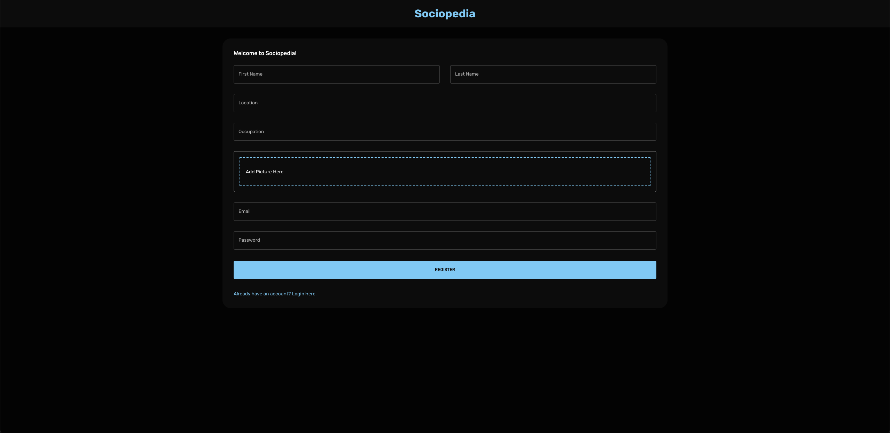
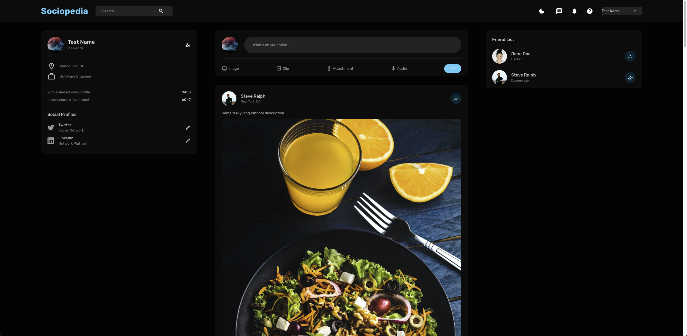
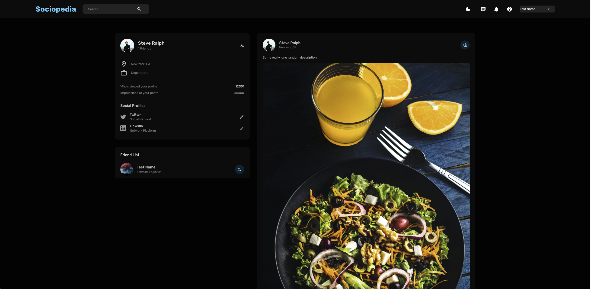
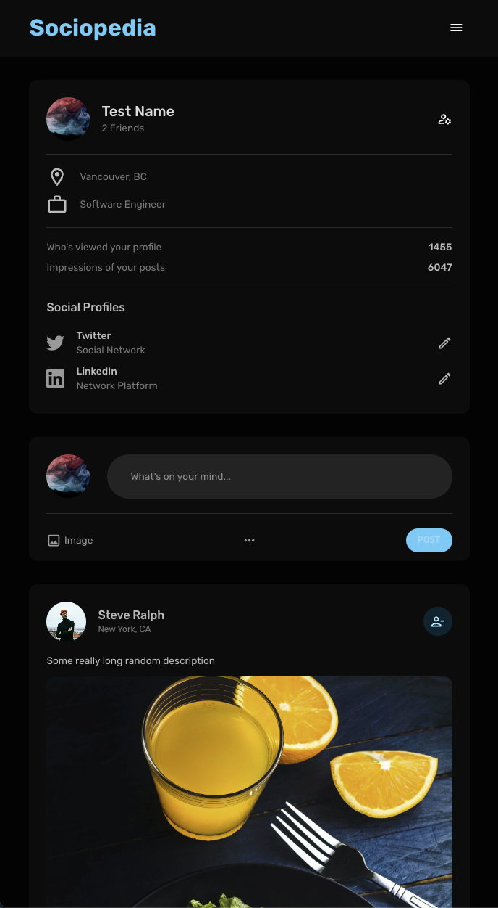

# Social Media Application
This repository contains a fully responsive full-stack social media application built using the MERN tech stack.  

Some of the main functionality of the website includes:
- Creating an account or logging in
- Adding Friends
- Viewing Profiles
- Creating Posts
- Liking Posts
- Light/Dark Mode Toggle

## Screenshots of Application
---
### Create Account Page
  

 

### Main Page

 

### Profile Page

 

### Main Page From Smaller Screen

 

## Additional Info
---
The server/public/assets folder contains some stock images that serve as dummy data for testing the application  
 

## Future Plans
---
Features to add in the future:
- delete accounts
- improve commenting functionality
    - put profile pictures next to comments
    - allow users to visit commenters' profiles
- allow linking to twitter and linkedIn
- allow users to sign in with Google
